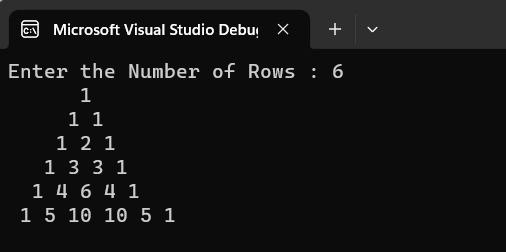
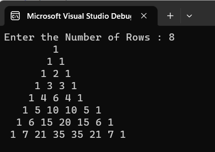

# Pattern

## Aim:
To write a C# program to print a pattern.

## Equipment Required:
Visual Studio

## Algorithm:
Step1:

Create a class and declare a variable with string datatype.

Step2:

Use for loop to check whether the input is a palindrome or not.

Step3:

Use if condition to check whether input is equal to the calculated number.

Step4:

Display the results of the condition of the input using Console.WriteLine().

## Program:
~~~
DEVELOPED BY : ANISH MJ
REGISTER NO  : 212221230005
~~~
~~~
using System;
using System.Globalization;

namespace Pattern
{
    class Pascal
    {
        static void Main(string[] args)
        {
            int n, i, j, c = 1, space;
            Console.Write("Enter the Number of Rows : ");
            n = Convert.ToInt32(Console.ReadLine());
            for (i = 0; i < n; i++)
            {
                for (space = 1; space <= n - i; space++)
                {
                    Console.Write(" ");
                }
                for (j = 0; j <= i; j++)
                {
                    if (i == 0 || j == 0)
                    {
                        c = 1;
                    }
                    else
                    {
                        c = c * (i - j + 1) / j;
                    }
                    Console.Write("{0} ", c);
                }
                Console.WriteLine();
            }
        }
    }
}

~~~
## Output:

## Result:
Thus the C# to print the pascal triangle is successfully executed.

